<picture>
  <source media="(prefers-color-scheme: dark)" srcset="assets/header-dark.svg">
  <source media="(prefers-color-scheme: light)" srcset="assets/header-light.svg">
  
</picture>

  
  &nbsp;
  
  &nbsp;&nbsp;&nbsp;
  
  &nbsp;
  

<picture>
  <source media="(prefers-color-scheme: dark)" srcset="assets/marquee-dark.svg">
  <source media="(prefers-color-scheme: light)" srcset="assets/marquee-light.svg">
  
</picture>

 

<!-- ═══════════════════════════════════════════ DEUTSCH ═══════════════════════════════════════════ -->

<b>🇩🇪 &nbsp;Deutsch</b> &nbsp;(zum Einklappen klicken)

 

<picture>
  <source media="(prefers-color-scheme: dark)" srcset="assets/divider-ueber-mich-dark.svg">
  <source media="(prefers-color-scheme: light)" srcset="assets/divider-ueber-mich-light.svg">
  
</picture>

<table>
<tr>
<td width="64%" valign="top">

### Zwischen Support-Ticket, Code und Datensatz.

Ich bin 2006 in Homs geboren, in Hamburg aufgewachsen und habe im Juni 2026 mein **Abitur mit Schwerpunkt Mathematik und Informatik** gemacht. Ab Oktober 2026 studiere ich **Data Science (B.Sc.) an der TU Hamburg**.

Mein Weg in die IT war praktisch: Scanner und Handhelds reparieren bei **Zetes**, Callcenter-Rechner betreuen bei **Gess Phone and Field**, IT-Support-Praktikum bei der **Otto Krahn Group**. 2026 durfte ich bei Zetes in einem **KI-Projekt zur Automatisierung wiederkehrender Abläufe** mitarbeiten: Prozesse analysieren, Lösungen testen, dokumentieren.

Parallel baue ich seit 2025 **Websites und Social-Media-Auftritte für über zehn Kunden** und eigene Software wie **Lexa AI**, einen lokalen KI-Desktop-Assistenten mit 1834 automatisierten Tests.

**Ich suche einen Werkstudenten-Job in Hamburg**, in dem ich Support, Entwicklung und Daten verbinden kann.

</td>
<td width="36%" valign="top" align="center">

 

| | |
|:--|:--|
| 📍 | Hamburg, Deutschland |
| 🎓 | TUHH · Data Science ab 10/2026 |
| 💼 | Freelance Web & Social Media |
| ⚽ | Jugendtrainer U8 · SC Alstertal-Langenhorn |
| 🗣️ | Arabisch · Deutsch · Englisch C1 · Spanisch |

</td>
</tr>
</table>

<table>
<tr>
<td align="center" width="25%"><h3>10+</h3>Kunden-Websites konzipiert und umgesetzt</td>
<td align="center" width="25%"><h3>138+</h3>PC-Befehle in Lexa AI</td>
<td align="center" width="25%"><h3>1834</h3>automatisierte Tests, grün auf GitHub Actions</td>
<td align="center" width="25%"><h3>5</h3>Praxisstationen in IT, Support und KI seit 2023</td>
</tr>
</table>

#### Womit ich arbeite

   
  

  
  
  
  
  
  
  
  

> **Wie ich arbeite:** KI-gestützt und mit Verantwortung. Claude Code, Codex und Antigravity gehören zu meinem Werkzeugkasten, so wie Git und ein Editor. Was zählt, ist das Ergebnis: Tests, die durchlaufen, Code, den ich erklären kann, und Projekte, die im Alltag benutzt werden.

<picture>
  <source media="(prefers-color-scheme: dark)" srcset="assets/divider-projekte-dark.svg">
  <source media="(prefers-color-scheme: light)" srcset="assets/divider-projekte-light.svg">
  
</picture>

<table>
<tr>
<td width="50%" valign="top">

### 🖥️ [Lexa AI](https://github.com/hamid49174/lexa-ai)
  

Lokaler KI-Desktop-Assistent für Windows. Steuert den PC per Sprache und Chat, lokal-first mit optionalen Cloud-Providern.

- **138+ PC-Befehle:** Apps, Fenster, Prozesse, Netzwerk, Dienste, Autostart
- **Voice-Pipeline:** Deepgram, Groq Whisper, faster-whisper · Cartesia, ElevenLabs, SAPI
- **Browser-Automation** mit Playwright, **Gedächtnis** mit SQLite FTS5
- **Sicherheit:** 3-Tier-Whitelist, Prompt-Injection-Defense, Rate Limiting, Audit-Log
- **Qualität:** 1834 Tests, Quality Gates, Release-Checks, PyInstaller-Build

`Python` `FastAPI` `Electron` `SQLite` `Playwright` `Gemini`

</td>
<td width="50%" valign="top">

### 🎮 [Gift Wars](https://github.com/hamid49174/gift-wars)
 

TikTok-LIVE-Overlay-Spiel. Zuschauer werden per Kommentar zu Spielern in einer 16:9-Arena, Gifts geben Punkte und Größe, stärkere Spieler werfen schwächere per Kollision raus.

- **Echtzeit** über Socket.io, Canvas-Arena mit TikTok-Profilbildern
- **3-Minuten-Runden**, Combo-Multiplikator, Power-Tiers, Top-10-Leaderboard
- Variante **Country Race** mit Länderflaggen und Rennmodus

`Node.js` `Express` `Socket.io` `React` `Vite`

</td>
</tr>
<tr>
<td width="50%" valign="top">

### 📊 [FinanzPilot](https://github.com/hamid49174/finanzpilot)

Finanz-Dashboard-UI mit selbst gebauten Chart-Komponenten: Bar, Donut, Sparkline, Progress-Ring. WebGL-Shader-Hintergrund, Liquid-Glass-Buttons, sieben Seiten von Dashboard bis Sparziele. Beispieldaten, kein Backend.

`Next.js` `React` `TypeScript` `shadcn/ui` `Tailwind` `WebGL`

</td>
<td width="50%" valign="top">

### 🎵 [Discord Spotify Sync Bot](https://github.com/hamid49174/discord-spotify-sync-bot)

Spiegelt die eigene Spotify-Wiedergabe in einen Discord-Voice-Channel: Spotify-OAuth, Now-Playing-Abgleich, Wiedergabe über Lavalink, Slash-Commands, Docker-Compose-Setup.

`TypeScript` `discord.js v14` `Lavalink v4` `Docker`

</td>
</tr>
<tr>
<td width="50%" valign="top">

### 📐 [Belvedere-Escher](https://github.com/hamid49174/belvedere-escher-blender)

Mathe am 3D-Modell. Eschers unmögliches *Belvedere* in Blender geladen, mit Winkel- (54°/74°), Abstands- (√2) und Koordinaten-Overlays versehen, als Vergleich Escher vs. geometrisch korrekt gerendert. Blender-Python-Skripte für Szene, Kameras und Renders.

`Blender` `Python` `3D`

</td>
<td width="50%" valign="top">

### 🌐 [ahamid.de](https://github.com/hamid49174/ahamid.de) &nbsp;·&nbsp; 🛤️ [claude-rails](https://github.com/hamid49174/claude-rails)

**ahamid.de:** meine Portfolio-Website ohne Framework, ohne Cookies, ohne Tracking. Partikelnetz, 3D-Tilt, magnetische Buttons, Timeline, alles mit `prefers-reduced-motion`.

**claude-rails:** mein `.claude/`-Setup für neue Projekte mit sechs Subagents, sechs Slash-Commands, Secret-Scan-Hook und CLAUDE.md-Skelett.

`HTML` `CSS` `JavaScript` `Claude Code` `Shell`

</td>
</tr>
</table>

<b>Kundenarbeiten</b> (private Repos, Einblick auf Anfrage): Gandom Bistro Hamburg · G&A Clean Concept Gebäudeservice Hamburg · Italiana Pizza e Caffè Bielefeld · NordWebSolution (Agentur-Website)

<picture>
  <source media="(prefers-color-scheme: dark)" srcset="assets/divider-erfahrung-dark.svg">
  <source media="(prefers-color-scheme: light)" srcset="assets/divider-erfahrung-light.svg">
  
</picture>

| Zeitraum | Station | Was ich gemacht habe |
|:--|:--|:--|
| seit 03/2025 | **Freiberuflich** · Webentwicklung, Social Media & Marketing | Websites für über zehn Kunden konzipiert und umgesetzt, Social-Media-Betreuung, Content, Online-Marketing |
| 07 – 08/2026 | **Zetes GmbH** · KI-Projekt & Prozessautomatisierung | Mitarbeit im KI-Projekt zur Automatisierung wiederkehrender Abläufe, Prozessanalyse, Test und Dokumentation |
| 07/2025 – 07/2026 | **Studyheads** · Aushilfe | Einsätze bei Kunden, u. a. Aufbau von Stadion-Werbeflächen |
| 07/2024 – 07/2025 | **Gess Phone and Field** · IT-Support Callcenter | Einrichtung und Betreuung der Callcenter-Software, First-Level-Support, Monitoring der Rechner |
| 09/2023 | **Otto Krahn Group** · Praktikum IT-Support | Betreuung und Wartung von IT-Systemen im Betriebsalltag |
| 07/2023 | **Zetes GmbH** · Repair & Service | Fehlerdiagnose, Reparatur und Funktionsprüfung von Scannern und Handhelds |
| seit 2025 | **SC Alstertal-Langenhorn e.V.** · Jugendtrainer U8 | Wöchentliches Training planen und leiten, Spiele und Turniere, Ansprechpartner für Eltern |

**Bildung & Zertifikate**

- 🎓 **TU Hamburg** · Data Science (B.Sc.) · immatrikuliert ab 10/2026
- 🎓 **Abitur 2026** · Stadtteilschule Poppenbüttel · Schwerpunkte Mathematik und Informatik
- 📜 **Google Data Analysis with Python** · Coursera-Spezialisierung, 6 Kurse (2026)
- 📜 **Foundations of Python Programming** · Packt / Coursera (2026)

<picture>
  <source media="(prefers-color-scheme: dark)" srcset="assets/divider-stats-dark.svg">
  <source media="(prefers-color-scheme: light)" srcset="assets/divider-stats-light.svg">
  
</picture>

  
  

  

<picture>
  <source media="(prefers-color-scheme: dark)" srcset="https://raw.githubusercontent.com/hamid49174/hamid49174/output/github-snake-dark.svg">
  <source media="(prefers-color-scheme: light)" srcset="https://raw.githubusercontent.com/hamid49174/hamid49174/output/github-snake.svg">
  
</picture>

<picture>
  <source media="(prefers-color-scheme: dark)" srcset="assets/divider-kontakt-dark.svg">
  <source media="(prefers-color-scheme: light)" srcset="assets/divider-kontakt-light.svg">
  
</picture>

  <b>Werkstudenten-Job in Data, KI oder IT in Hamburg? Website oder Social Media für dein Unternehmen?</b> 
  Eine E-Mail reicht. Antwort in der Regel innerhalb von 24 Stunden.

  
  
  

<a href="#top">↑ nach oben</a>

 

<!-- ═══════════════════════════════════════════ ENGLISH ═══════════════════════════════════════════ -->

<b>🇬🇧 &nbsp;English</b> &nbsp;(click to expand)

 

<picture>
  <source media="(prefers-color-scheme: dark)" srcset="assets/divider-about-dark.svg">
  <source media="(prefers-color-scheme: light)" srcset="assets/divider-about-light.svg">
  
</picture>

<table>
<tr>
<td width="64%" valign="top">

### Between support ticket, code and dataset.

Born in Homs in 2006, raised in Hamburg. I finished high school in June 2026 with a **focus on mathematics and computer science** and start **Data Science (B.Sc.) at Hamburg University of Technology (TUHH)** in October 2026.

My way into IT was hands-on: repairing scanners and handhelds at **Zetes**, looking after call-centre PCs at **Gess Phone and Field**, an IT-support internship at **Otto Krahn Group**. In 2026 I joined an **AI project at Zetes automating recurring workflows**: analysing processes, testing solutions, writing documentation.

Since 2025 I also build **websites and social-media presences for more than ten clients**, plus my own software such as **Lexa AI**, a local AI desktop assistant backed by 1,834 automated tests.

**I'm looking for a working student position in Hamburg** where support, development and data meet.

</td>
<td width="36%" valign="top" align="center">

 

| | |
|:--|:--|
| 📍 | Hamburg, Germany |
| 🎓 | TUHH · Data Science from 10/2026 |
| 💼 | Freelance web & social media |
| ⚽ | Youth football coach U8 |
| 🗣️ | Arabic · German · English C1 · Spanish |

</td>
</tr>
</table>

<table>
<tr>
<td align="center" width="25%"><h3>10+</h3>client websites designed and built</td>
<td align="center" width="25%"><h3>138+</h3>PC commands in Lexa AI</td>
<td align="center" width="25%"><h3>1,834</h3>automated tests, green on GitHub Actions</td>
<td align="center" width="25%"><h3>5</h3>hands-on roles in IT, support and AI since 2023</td>
</tr>
</table>

#### What I work with

   
  

> **How I work:** AI-assisted and accountable. Claude Code, Codex and Antigravity are part of my toolbox, just like Git and an editor. What counts is the result: tests that pass, code I can explain, and projects people actually use.

<picture>
  <source media="(prefers-color-scheme: dark)" srcset="assets/divider-projects-dark.svg">
  <source media="(prefers-color-scheme: light)" srcset="assets/divider-projects-light.svg">
  
</picture>

<table>
<tr>
<td width="50%" valign="top">

### 🖥️ [Lexa AI](https://github.com/hamid49174/lexa-ai)
 

Local AI desktop assistant for Windows. Controls the PC by voice and chat, local-first with optional cloud providers.

- **138+ PC commands:** apps, windows, processes, network, services, autostart
- **Voice pipeline:** Deepgram, Groq Whisper, faster-whisper · Cartesia, ElevenLabs, SAPI
- **Browser automation** with Playwright, **memory** with SQLite FTS5
- **Security:** 3-tier whitelist, prompt-injection defense, rate limiting, audit log
- **Quality:** 1,834 tests, quality gates, release checks, PyInstaller build

`Python` `FastAPI` `Electron` `SQLite` `Playwright` `Gemini`

</td>
<td width="50%" valign="top">

### 🎮 [Gift Wars](https://github.com/hamid49174/gift-wars)

TikTok LIVE overlay game. Viewers join a 16:9 arena by commenting, gifts add score and size, stronger players knock out weaker ones on collision.

- **Real-time** via Socket.io, canvas arena with TikTok profile pictures
- **3-minute rounds**, combo multiplier, power tiers, top-10 leaderboard
- **Country Race** variant with country flags and race mode

`Node.js` `Express` `Socket.io` `React` `Vite`

</td>
</tr>
<tr>
<td width="50%" valign="top">

### 📊 [FinanzPilot](https://github.com/hamid49174/finanzpilot)

Personal-finance dashboard UI with hand-built chart components: bar, donut, sparkline, progress ring. WebGL shader background, liquid-glass buttons, seven pages from dashboard to savings goals. Sample data, no backend.

`Next.js` `React` `TypeScript` `shadcn/ui` `Tailwind` `WebGL`

</td>
<td width="50%" valign="top">

### 🎵 [Discord Spotify Sync Bot](https://github.com/hamid49174/discord-spotify-sync-bot)

Mirrors your own Spotify playback into a Discord voice channel: Spotify OAuth, now-playing sync, playback via Lavalink, slash commands, Docker Compose setup.

`TypeScript` `discord.js v14` `Lavalink v4` `Docker`

</td>
</tr>
<tr>
<td width="50%" valign="top">

### 📐 [Belvedere-Escher](https://github.com/hamid49174/belvedere-escher-blender)

Maths on a 3D model. Escher's impossible *Belvedere* loaded into Blender, annotated with angle (54°/74°), distance (√2) and coordinate overlays, rendered as Escher vs. geometrically correct. Blender Python scripts for scene, cameras and renders.

`Blender` `Python` `3D`

</td>
<td width="50%" valign="top">

### 🌐 [ahamid.de](https://github.com/hamid49174/ahamid.de) &nbsp;·&nbsp; 🛤️ [claude-rails](https://github.com/hamid49174/claude-rails)

**ahamid.de:** my portfolio site without framework, cookies or tracking. Particle network, 3D tilt, magnetic buttons, timeline, all respecting `prefers-reduced-motion`.

**claude-rails:** the `.claude/` setup I copy into every new project: six subagents, six slash commands, secret-scan hook, CLAUDE.md skeleton.

`HTML` `CSS` `JavaScript` `Claude Code` `Shell`

</td>
</tr>
</table>

<b>Client work</b> (private repos, available on request): Gandom Bistro Hamburg · G&A Clean Concept building services Hamburg · Italiana Pizza e Caffè Bielefeld · NordWebSolution (agency website)

<picture>
  <source media="(prefers-color-scheme: dark)" srcset="assets/divider-experience-dark.svg">
  <source media="(prefers-color-scheme: light)" srcset="assets/divider-experience-light.svg">
  
</picture>

| Period | Role | What I did |
|:--|:--|:--|
| since 03/2025 | **Freelance** · web development, social media & marketing | Designed and built websites for 10+ clients, social-media management, content, online marketing |
| 07 – 08/2026 | **Zetes GmbH** · AI project & process automation | Contributed to an AI project automating recurring workflows; process analysis, testing, documentation |
| 07/2025 – 07/2026 | **Studyheads** · temp staff | On-site client assignments, e.g. setting up stadium advertising |
| 07/2024 – 07/2025 | **Gess Phone and Field** · IT support, call centre | Set up and maintained call-centre software, first-level support, PC monitoring |
| 09/2023 | **Otto Krahn Group** · IT support internship | Maintenance and support of IT systems in daily operations |
| 07/2023 | **Zetes GmbH** · repair & service | Diagnosis, repair and testing of scanners and handhelds |
| since 2025 | **SC Alstertal-Langenhorn e.V.** · youth coach U8 | Plan and run weekly training, matches and tournaments, point of contact for parents |

**Education & certificates**

- 🎓 **Hamburg University of Technology (TUHH)** · Data Science (B.Sc.) · enrolled from 10/2026
- 🎓 **Abitur 2026** · Stadtteilschule Poppenbüttel · focus on mathematics and computer science
- 📜 **Google Data Analysis with Python** · Coursera specialisation, 6 courses (2026)
- 📜 **Foundations of Python Programming** · Packt / Coursera (2026)

<picture>
  <source media="(prefers-color-scheme: dark)" srcset="assets/divider-stats-dark.svg">
  <source media="(prefers-color-scheme: light)" srcset="assets/divider-stats-light.svg">
  
</picture>

  
  

<picture>
  <source media="(prefers-color-scheme: dark)" srcset="assets/divider-contact-dark.svg">
  <source media="(prefers-color-scheme: light)" srcset="assets/divider-contact-light.svg">
  
</picture>

  <b>Working student role in data, AI or IT in Hamburg? A website or social media for your business?</b> 
  One e-mail is enough. I usually reply within 24 hours.

  
  
  

<a href="#top">↑ back to top</a>

<picture>
  <source media="(prefers-color-scheme: dark)" srcset="assets/footer-dark.svg">
  <source media="(prefers-color-scheme: light)" srcset="assets/footer-light.svg">
  
</picture>
